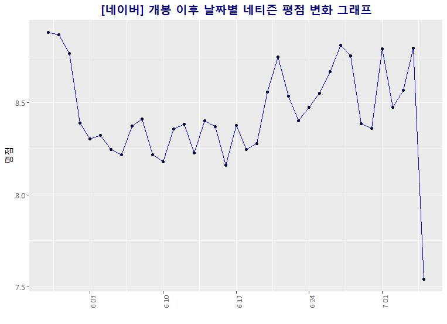
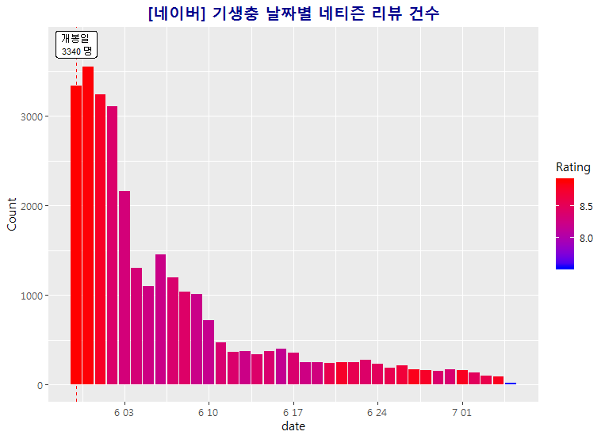

```{r setup, include=FALSE}
knitr::opts_chunk$set(echo = TRUE)
library(rvest)
library(stringr)
library(XML)
library(dplyr)
library(extrafont)
library(wordcloud)
library(wordcloud2)
windowsFonts()
windowsFonts(malgun = "맑은 고딕")
#theme_update(text = element_text(family = "malgun"))

trim <- function (x) gsub("^\\s+|\\s+$", "", x)
trim2 <- function(x) gsub("\\n","",x)
trim3 <- function(x) gsub("\\t","",x)
trim4 <- function(x) gsub("\\r","",x)


```
## 여러개의 영화리뷰 사이트 분석을 통한 기생충 영화 네티즌 평가 

## 네이버 
https://movie.naver.com/movie/bi/mi/point.nhn?code=161967에서 모든 평점을 불러온 후 워드클라우드 와 데이터 시각화를 통한 분석

```{r}
url <- "https://movie.naver.com/movie/bi/mi/pointWriteFormList.nhn?code=161967&type=after&isActualPointWriteExecute=false&isMileageSubscriptionAlready=false&isMileageSubscriptionReject=false&page="
rating <- c()
review <- c()
date <- c()
```


```{r eval= FALSE}
#2929
for (i in 1:2929) {
  if (i %% 500 == 0) {print(i)}
  html <- read_html(paste0(url,i))
  html %>% 
    html_node(".score_result") %>%
    html_nodes("li") -> lis
  
  for (li in lis) {
    rating <- c(rating, html_node(li, '.star_score') %>% html_text('em') %>% trim())
    li %>%
      html_node('.score_reple') %>%
      html_text('p') %>%
      trim() -> tmp
    idx <- str_locate(tmp, "\r")
    review <- c(review, str_sub(tmp, 1, idx[1]-1))
    tmp <- trim(str_sub(tmp, idx[1], -1))
    idx <- str_locate(tmp, "\r")
    writer <- c(writer, str_sub(tmp, 1, idx[1]-1))
    tmp <- trim(str_sub(tmp, idx[1], -1))
    idx <- str_locate(tmp, "\r")
    date <- c(date, str_sub(tmp, 1, idx[1]-1))
    #print(time)
  }
    
}
```

2929번 돌린 loop에서 나온 변수들을 data frame 으로 저장 시켜준다. 
```{r}
df.review <- data.frame(rating = rating, user_review = review, date = date)
# 이후 영화 변수명의 편리를 위해 변수명을 바꾸어 준다. 
df_naver.review <- df.review
head(df_naver.review)
```

### Word Cloud 생성 
Library 준비
```{r}
library(wordcloud2)
library(KoNLP)
```

Word Cloud 생성 과정 
```{r eval=FALSE}
#write(review, "naver_review1.txt")
#data <- readLines('naver_review.txt')
#data1 <- sapply(data, extractNoun, USE.NAMES = F)

#data3 <- unlist(data1)
#data3 <- gsub("\\d+","",data3) ## 숫자 없애기 
#data3 <- Filter(function(x) {nchar(x) >= 2}, data3) #2글자 이상 필터 
#data4 <- str_replace_all(data3, "[^[:alpha:]]","") #한글, 영어이외는 삭제


#txt2 <- readLines("네이버영화gsub.txt")
#for(i in 1:length(txt2)) {
#  data5 <- gsub(txt2[i],"",data4)
#}
#txt2[1]
#data5 <- gsub("영화","",data5)
#data5 <- gsub("관람객","",data5)

#write(data5,"parasite_Naver2.txt")
data6 <- read.table("parasite_Naver2.txt")
nrow(data6)
wordcount <- table(data6)
wordcloud <-sort(wordcount,decreasing = T)
#head(wordcloud)

wordcloud2(wordcloud)

```
* 워드클라우드의 정확성을 위해 위와같이 "영화", 관람객"등 단어를 빼준다. 


### 워드클라우드 결과 


#### 네이버와 다음 워드 클라우드의 비교는 아래 자세하게 다룬다.  


### ggplot을 통한 데이터 시각화

#### 개봉 이후 날짜별 네티즌 평점 변화 그래프
```{r eval=FALSE}
# Plot of user rating and time to see how the user rating went as the movie came out
library(ggplot2)
#theme_set(theme_classic()) # change the theme to my preferece 

#View(df_naver.review)
df_naver.review$rating <- as.numeric(as.character(df_naver.review$rating))
 
df_naver.review$date <- substr(df_naver.review$date,1,10)
df_naver.review$time <- substr(df_naver.review$date_time,12,16)
df_naver.review$hour <- substr(df_naver.review$date_time,12,13)

names(df_naver.review) <- c("rating"   ,   "user_review", "date_time"      ,  "date"   ,   "time"    )
#View(df_naver.review)
time.sort <- df_naver.review %>% 
  select(rating,date) %>%
  group_by(date) %>%
  summarise(review_mean = mean(as.numeric(rating)))
#View(time.sort)
df_naver.review$date <-as.Date(df_naver.review$date, "%Y.%m.%d")

# line Plot of rating per day from release date
naver.P1 <- ggplot(time.sort,aes(x = date, y = review_mean,group = 1)) + 
  geom_point() +
  geom_line(color = "blue") + 
  ggtitle("[네이버] 개봉 이후 날짜별 네티즌 평점 변화 그래프") + 
  theme(axis.text.x = element_text(size = 8, angle = 90)) +
  theme(plot.title = element_text(face = "bold", hjust = 0.5, size = 15, color = "darkblue")) + 
  ylab("평점") + xlab("")
```

> 평점은 주로 8.0점에서 9.0점 사이에 있다는 것을 볼 수있다. 더 자세한 분석은 아래 다음 사이트와 함꼐 다룬다. 

### 시간별 네티즘 평점 변화 
```{r eval=FALSE}
# bar graph of time and review
df_naver.review$hour <- substr(df_naver.review$time,1,2)
df_naver.review$time
sort.byTime <- df_naver.review %>% 
  select(rating,time,hour) %>%
  group_by(hour)%>%
  summarise(rating = mean(rating))
class(sort.byTime$hour)
sort.byTime$hour <- as.numeric(sort.byTime$hour)
View(sort.byTime)

ggplot(sort.byTime,aes(hour,rating,group=1)) + geom_point() + geom_line(color="red") + 
  ggtitle("[네이버] 개봉 이후 시간별 네티즌 평점 변화 그래프") + 
  theme(plot.title = element_text(face = "bold", hjust = 0.5, size = 15, color = "darkblue"))
   
```

#### 5시와 6시 사이에 가장 낮은 8.0에 가까운 평점을 보이며 자세한 분석은 아래 [다음]영화와 같이 비교 분석 되어있다. 

### 날짜별 네티즈 리뷰 건수 
```{r eval=FALSE}
# bar graph of day and num of people who wrote reviews
sort.byPeople <- df_naver.review %>% 
  select(rating,date,time) %>%
  group_by(date) %>%
  summarise(Count = n(), Rating = mean(rating))
View(sort.byPeople)
firstday <- sort.byPeople$Count[1]
firstday
ps.release.date <- as.Date("2019-05-30","%Y-%m-%d")
ggplot(sort.byPeople, aes(date,Count,fill=Rating,)) + geom_col() + 
  scale_fill_gradient(low="blue", high="red") + ggtitle("[네이버] 기생충 날짜별 네티즌 리뷰 건수") + 
  theme(plot.title = element_text(face = "bold", hjust = 0.5, size = 15, color = "darkblue")) +
  geom_vline(xintercept = ps.release.date, linetype="dashed", color = "red",label = "Release Date") +
  geom_label(aes(x=sort.byPeople$date[1], label="개봉일 \n 3340 명", y=3800), colour="black", size = 2.8,fill = "white")
```



### [다음] 영화에서도 같은 방식으로 데이터를 불러와 분석한다. 


#### 다음 영화 네티즌 리뷰 vs 네이버 영화 Word Cloud 
다음 영화 기생충 Word Cloud


네이버 영화 기생충 Word Cloud


IMDB Word Cloud


> 기생충 다음과 네이버 영화 Word Cloud 분석을 해본 결과 두 사이트 모두 '생각'이라는 단어가 제일 자주 나오고, 또한 '최고','진짜연기','재미'와 같은 단어가 자주 나오는 것을 봄으로써 긍정적인 평가가 많이 나온다고 볼수 있다. 또한 '현실','사회','이해','사람','냄새' 와 같은 단어가 자주 나오는 것을 봄으로써 영화 내용이 현실과 사회에 대한 감독의 생각과 메세지가 담겨있다는 것을 관객들이 인상 깊게 봤다고 볼수 있다.   
또한 불편,불쾌,충격 이라는 단어들이 나오는 것을 봄으로써 관객들이 분편한 부분 불쾌한 부분 충격적인 부분을 기억하고 있다는 것을 볼수 있다. 
결과적으로 두 사이트 모두 관객들이 대체적인 긍적적인 단어들이 보임으로써 생각하게 만드는 영화라고 볼수있다.  
> 또한 다음과 네이버의 워드클라우드 구성이 거의 같은 모습을 보인다. 이는 어느 사이트에서나 사람들이 남기는 반응이 비슷한 모습을 보인다고 볼수 있다. 

> 마지막으로 Imdb에서 불러온 결과로 WordCloud를 생성해 보았다. 많은 결과를 불어오지 못해 가장 많은 단어가 Family 가족으로 27번 반복 되었다. 주로 줄거리를 이야기 하고 영화에 어떤 부분을 특정잡아 이야기 할때 이 단어를 사용하는 것을 찾아 볼수 있다. 

### 다음과 네이버 영화 평점 비교 

#### 날짜별 평점

> 다음 평점은 개봉후에 주로 7점과 8점 사이에 평점이 주어지고 있다는 것을 볼수 있다. 개봉전에는 많은 기대로 인해 평점이 높은 편에서 개봉후에 서서히 떨어지는 추세를 보이고 있으나 최근 들어서 높은 평균을 보여주는 것을 볼수 있다. 


> 네이버에서 평점 역시 개봉후 서서히 떨어지는 평균을 볼수있으며 다음 네티즌들 보다는 높은 8-9 사이의 평균을 보여주고 있다. 다음 영화와는 반대로 네이버는 최근 들어서 낮은 평균을 보여주는 것을 볼수있다. 


> 다음보다 네이버 이용자들이 기생충 영화를 더욱 높은 평점을 주었다. 네이버 네티즌은 8.51 다음 네티즌은 7.8 평균으로 평점을 주었으며 날짜별로 변동이 있지만 주로 같은 구간에 평점이 주어졌으며 다음은 최근 들어 평점이 올라가는 추새 네이버는 조금 떨어지는 추세를 보여준다. 이는 데이터 날짜별 리뷰자 수를 분석함으로써 연관성이 있는 지 확인해 볼수 있다. 


### 시간별 평점 


> 이 그래프에서 인상 깊게 볼수 있는 것은 오전 5시 - 6시 사이에 두사이트 모두 비교적 낮은 평점을 주었단 점이다. 그리고 새벽 12시에서 2시 사이에 비교적 높은 평점을 주었다는 점이다. 오후 시간에는 비교적 평균애 가까운 평점이 주어졌다.  
이는 시간별 리뷰수를 분석하여 분석하는 사람의 수와 관계가 있는지 알아볼수 있다. 

### 날짜별 리뷰수


>다음과 네이버의 기생충 리뷰면으로만 보았을때, 네이버에 훨씬 더 많은 사람들이 리뷰를 남기며 비교적 더 높은 평균을 주는것을 볼수있다. 

>또한 다음 영화사이트에서는 첫 개봉날에 가장 많은 리뷰를 그리고 네이버에서는 둘째날에 가장 많은 리뷰를 남긴 것을 관찰할수있다. 

>네이버에 비해 다음 네티즌 리뷰가 조금더 넓은 변화량을 보여주고 있으며 

>개봉일에서 멀어질수록 관심은 떨어지고 리뷰를 다는 사람들이 줄어든다는 것은 당연하다고 볼수 있다. 하지만 인기가 많은 영화일 수록 리뷰를 다는 기간이 길어질것으로 예측을 하는 다른 영화와의 비교도 핅요하다. 


### 시간별 리뷰수


> 도표에서 볼수 있듯이 새벽 4시에서6시 사이에 가장 적은 사람들이 리뷰를 작성하였고 밤 10-12시이에 가장 많은 사람들이 리뷰를 작성 하였다. 또한 5시에서 6시 사이에 가장 적은 평점을 반은 것으로 보인다.  

## Conclusion 
 Word Cloud 에서도 보였던 긍정적인 반응, 섞인 반응 등이 다른 그래프에도 보여졌다. 평균은 7.9~8.5 사이에서 비교적 높은 평균을 받았으며 리뷰를 적는 시간에 따라 리뷰 평점에 차이가 난다는 흥미로운 점을 볼 수 있다. 또한 날짜별로 평점을 분석해본 후 개봉 직후의 평점이 내려가는 추세를 보인다는 점에서 영화 관람객들의 개대에 대한 (평점에 대한) 실망감이 있었을수 있다는 것과 함계 생각해 볼 수 있다.  


## Improvments
다음 단계에서 노력해야 할 것은 일단 크게 세가지로 구분할수 있다. 
* 뚜렷한 목표가 있고 어떤것을 분석 해서 어떤 결과를 가져올 것이지 미리 생각 해보고 정리한 후 분석 시작 하기. 
* 어쩔때는 데이터 분석중 다른 어떤것과 같이 분석해보면 좋겠다라고 생각 할때가 많다. 그렇게 되면 또 다시 자료를 모아 와야하고 여러가지 불편함이 있을 수 있는데 미리 생각을 해두고 자료 분석을 시작하기. 
* Data Visualization을 통해 그래프를 그린 후 한 단계 더 나아가 분석해야 하는 무엇이 필요함. 통계학의 지식을 키우고 자료를 분석후 연관성을 찾고 분석할수 있는 전문성과 Insight 이 두가지가 모두 필요하다. 

이를 키우기 위해서는 통계를 더욱 집중적으로 공부하고 또한 Data 분석 실력을 키우며, 많은 연습을 통한 Insight를 키워야 한다.

## Other things to consider
When I began this project my goal was to compare data between the differences of American and Korean movie viewers on a certain movie. I had assumed that American viewers and Korean viewers have a different view of the movie and have different thoughts about the movie. However I was unable to perform crawling using R on Rottentomatoes. An Alternative movie review website I could use is IMDB.
Instead I decided to review the data from two different Korean websites on how the reviewers viewed the movie "기생충". Which was a very big movie in Korea and had a lot of hype built up beacuse it had recieved the Cannes' top prize. 
The two websites are similar one being Naver the most popular search site in Korea and Daum, the second most Korean popular site however lacking behind compared to Naver. 
I was able to crawl much more data from Naver Movies however I wanted to compare that data with how the Daum data turned out. 
My hypothesis is that these two datas would be very similar and that the only difference would be the number of data.   